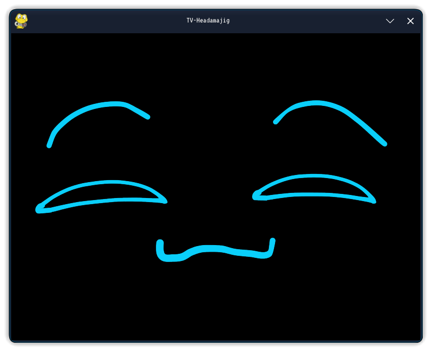
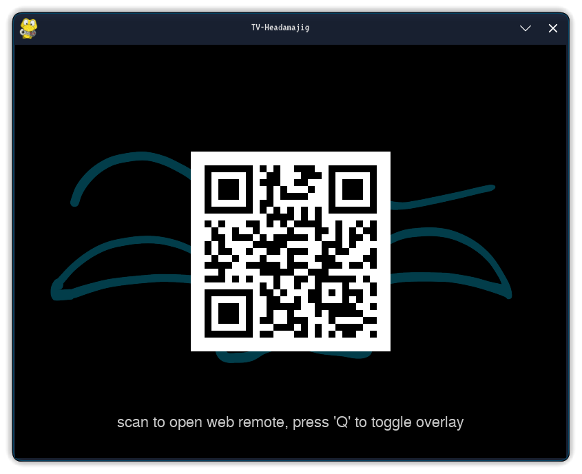
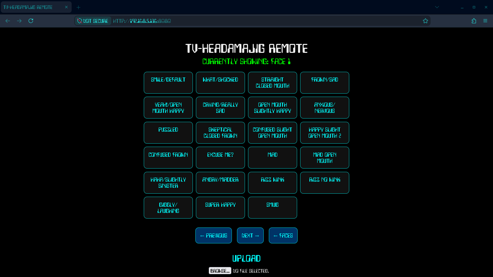
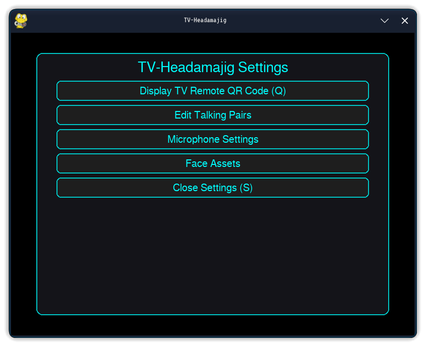

# TV-headamajig
A neat Python program for epic TV head cosplays that involve a full color display (like LCD/OLED) or other usecases, utilizing pygame and flask.

# !!! NOTE: This program's development was assisted to some extent with AI to fix bugs and add some implementations more swiftly.
I hope this doesn't upset anyone away. I didn't initially intend to publish this program as it was to be for my own personal use.

# Using this program
This program was primarily intended for my own personal use for my own TV head cosplay, but I have decided to share it to GitHub to see what others do with it. I have made some special changes so that anyone can personally modify the code and/or settings to plug in their own assets, customize the locally hosted TV remote website you can access on your phone (or other device), add their own features, etc.

# Features
- Local TV web remote via QR code

- Display your own TV face assets within the assets folder
- Upload & display most images, videos (with or without audio), and GIFs from the Local TV web remote (saved to the uploads folder)
- The program's python code is publicly available for you to fork/modify, make it your own for your TV head project :)
- Alternatively, this program may be unofficially viable for online streaming and video calling, feel free to play around with it!
- Microphone support & face/talking pairing: pair one face asset to transition to another when speaking with your microphone enabled

enjoy :)
